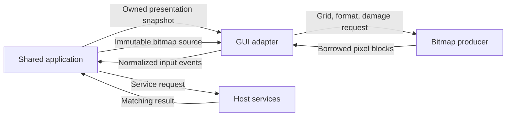

# Widget boundary specification

This document defines a general-purpose GUI boundary suitable for a future
project specification. **Must** denotes required behavior. **May** denotes an
implementation choice that preserves the stated behavior. The C++ reference
uses owned values and a display-free adapter to make these rules executable.

Related contracts specify [bitmaps](bitmap-contract.md),
[layout](layout-contract.md), and [runtime services](runtime-contract.md).

## 1. Responsibility and data direction

The shared application owns authoritative values, action meaning, availability,
view composition, and bitmap producers. The adapter owns native objects,
native event translation, display resources, focus mechanics, and host calls.

The adapter must interpret widget kinds and generic policies. Application binding
IDs, option IDs, row IDs, and bitmap source IDs are opaque. Labels must never
determine behavior. A shared application can use several controls bound to one
value; each retained control still needs its own widget key.

The public dependency graph must contain no application implementation or native
toolkit types. Source factories may capture private data internally; their
public output is a `BitmapSource` handle.

## 2. Complete core vocabulary

| Kind | Presentation input | User output | Required native behavior |
| --- | --- | --- | --- |
| `group` | Bounds, optional interior clip, content extent, visibility, enablement | No direct action | Own children, clip descendants, retain scrolling |
| `label` | Literal text, font, tone, bounds | None | Draw readable native text |
| `button` | Label, help, availability | `Activate` | Pointer and keyboard activation |
| `toggle` | Label, checked state, availability | `SetChecked` | Expose a boolean control and its accessible state |
| `choice` | Ordered options, optional selected ID, placeholder, optional display text | `ChooseOption` | Closed dropdown selection by stable ID |
| `text` | Text policy, text, optional suggestions, placeholder | `EditText`, `ChooseOption`, `SubmitText` | Native editor, atomic validation, retained caret and selection |
| `list` | Ordered structured records, optional selected ID, row height, content width | `SelectRecord`, `ActivateRecord` | Stable rows, keyboard navigation, scrolling, empty text |
| `bitmap` | Opaque source, source ID, revision, bounds, named actions | Optional `PointerInput`, `InvokeAction` | Request and display pixels; retain native accessible description |
| `menu` | Label and ordered enabled/disabled options | `ChooseOption` | Native action menu with stable item IDs |

`PointerInput` can also be enabled on another kind with `pointer_input`. This is
an explicit input capability. The application decides what the input means.

A page is a stable ID, a literal label, and visible/enabled state. `PageEvent`
requests a page change. `ResizeEvent` reports logical client size and display
scale. `CloseEvent` requests closure; shared application handling starts its
shutdown sequence.

The core uses these primitives to compose ordinary interfaces. A numeric field
can use a text editor with application validation; an exclusive set can use a
choice; a progress readout can use native text and a bitmap. Additional native
primitives can be specified separately when their input/output semantics require
them.

## 3. Snapshot and identity contract

`Snapshot` owns its title, pages, widget declarations, widget state, and retained
bitmap handles. `present(Snapshot)` accepts it by value. The caller can release
or alter its original strings, vectors, and records after the call returns.
Captured bitmap data follows its separate immutable-lifetime contract.

| Value | Rule |
| --- | --- |
| `Snapshot::revision` | Informational presentation token. The reference validates every call, including equal tokens. It does not infer ordering from the number. |
| `WidgetKey::id` | Nonempty UTF-8 string, unique across the entire snapshot. |
| `WidgetKey::generation` | Nonzero integer. An ID's replacement generation must be greater than any generation previously used for that ID in the adapter lifetime. |
| `WidgetSpec` | Immutable while the same key survives. Change the generation to change its kind, binding, parent, page, or input policy. |
| `WidgetSpec::binding` | Optional opaque association interpreted by the shared application. |
| `WidgetSpec::page` | Empty means persistent. Otherwise it names a declared page. |
| `WidgetSpec::parent` | Empty means root. Otherwise it names an earlier `group` on the same page. |
| `WidgetState` | Current mutable presentation, including geometry and values. |
| Option and record IDs | Nonempty and unique within their owning widget; labels may repeat. |
| `selected` | Optional ID. An absent or no-longer-listed ID displays no selected row/option. The saved ID is not silently rewritten. |
| Bitmap identity | `(source_id, revision)` identifies immutable content. Geometry and pixel format are independent cache inputs. |

All declarations must validate before an adapter changes its observable state.
Duplicate IDs, invalid text, invalid geometry, wrong parent ordering, illegal
kind/state combinations, or reused generations reject the entire presentation.
Memory allocation failure also leaves the previous reference presentation intact.

Removal destroys retained state for that key. Reintroduction requires a new
generation. A queued callback containing an older key must be ignored. A native
implementation must create parents before children and destroy children before
parents. Reordering must preserve surviving keys and their retained state.

`MemoryAdapter` retains generation history for its lifetime. Generation exhaustion
requires a fresh adapter lifetime; integer wrap does not authorize reuse.

## 4. Common presentation properties

`bounds` is the unscrolled rectangle in logical client coordinates. It includes
the control's allocated area. `label`, `text`, `help`, `accessible_name`,
`placeholder`, and `display_text` are owned, literal UTF-8 strings without zero
bytes. `font` supplies logical size, boldness, and a semantic tone. `wrap` is `none`
or `word`; it supplies the same native wrapping choice to drawing and
measurement. Native text cells carry their own `wrap`. Explicit line breaks
remain line breaks in both modes. With `none`, horizontal overflow is clipped;
with `word`, the native text engine wraps at its normal word boundaries and
breaks an oversized item as needed. A zero width yields no visible text. These state
properties, including labels and help, can change without a new generation.

The displayed text fields have explicit roles:

| Target | Visible text |
| --- | --- |
| Label | `state.text` |
| Button, toggle, menu | `state.label` |
| Text editor | `state.text`, or `placeholder` when empty |
| Closed choice | Nonempty `display_text`, otherwise the current option's label, otherwise `placeholder` |
| List | Record cells; `placeholder` when there are no records |
| Bitmap | Pixel content; caption is a separate label widget |

For text, choice, list, and bitmap widgets, `state.label` names the control for
accessibility fallback. A visible external heading is a separate label widget
with its own layout. Help is native tooltip/help text. `accessible_name` supplies
the explicit accessible name when present.

Native adapters must escape or bypass special label parsing so punctuation is
displayed literally. Text content must not become native markup, an implicit
shortcut, or a submenu separator. Native font fallback and text direction must
support the platform's normal readable text behavior.

`visible` determines display eligibility; `enabled` determines interaction
eligibility. An unavailable ancestor or page restricts all descendants. An
inactive page hides its controls. A zero-area or fully clipped control does not
draw or accept input. The visible intersection is used for pointer hit testing.

Labels, help, and accessible names have separate roles. A native adapter should
use `accessible_name` when supplied, then a suitable visible label. Bitmap
descriptions and structured record `accessible_text` must be available to
assistive technology. A meaningful accessible description is supplied by the
shared application; it is not inferred from pixel bytes.

Semantic tones are `normal`, `muted`, `accent`, and `error`. A native theme maps
them consistently for labels, record cells, and captions. It must expose disabled
state and keyboard focus visibly and through native accessibility APIs. A user
must be able to understand status through text as well as color.

## 5. Inputs and authoritative updates

`Event` is an owned value delivered through `EventSink`. `send` owns that value
for the synchronous callback; the sink receives a const reference and must copy
the event to retain or queue it beyond the callback. Widget input contains
the exact `WidgetKey` of the native object that originated it. It must never
contain a borrowed toolkit pointer or mutable native item index.

| Input | Accepted target and payload |
| --- | --- |
| `Activate` | Enabled, visible button |
| `SetChecked{value}` | Toggle whose current checked value differs |
| `EditText{value, base_text}` | Editable text; base equals current text; candidate is valid and differs |
| `ChooseOption{id}` | Current enabled option of a choice, menu, or editable text suggestion set |
| `SelectRecord{id}` | Current enabled record in a list |
| `ActivateRecord{id}` | Current enabled, activatable record; represents selection and activation together |
| `SubmitText` | Editable text with a declared submission policy |
| `InvokeAction{id}` | Current enabled named action on an enabled, visible bitmap |
| `PointerInput` | Explicitly opted-in control; finite position inside its effective clip; finite wheel values |
| `PageEvent{id}` | Different visible, enabled declared page |
| `ResizeEvent` | Finite bounded size and positive supported display scale |
| `CloseEvent` | Live adapter lifetime |

The adapter first checks the latest applied presentation. The shared application
must repeat checks against its current authoritative state if that state can
advance before presentation. A delayed callback cannot make a hidden, disabled,
removed, or replaced target eligible again.

`normalize_event(snapshot, event, scroll_lookup)` implements these checks once
for adapters and shared handlers. It returns acceptance and normalizes a declared
select-and-activate interaction in place. `normalize_widget_event` is the same
operation for a widget event alone. The snapshot must already be validated;
the lookup supplies current group offsets, or its omission means zero scrolling.
These helpers do not dispatch or mutate the snapshot. The caller separately
enforces its lifecycle and callback guards. The shared example uses this helper
against its own model, including when an accepted event was queued before the
model changed.

`Delivery::delivered` means the event reached the sink. It does not mean an
application operation completed or that a value was accepted. The application
publishes the resulting state. An ignored input emits no application event and
does not change authoritative values. Popup dismissal and keyboard scrolling
may still occur as native interaction mechanics.

Programmatic `present`, focus changes, scrolling, text selection changes, bitmap
updates, and popup dismissal must emit no user events. Native setters that
normally invoke callbacks require an explicit suppression guard.

In the reference, a sink can synchronously publish another snapshot or call
`close`. Recursive `send` is ignored. A sink exception propagates to the caller
after the dispatch guard resets. Native callbacks must catch exceptions and
report them through the application's error handling. Destruction of the adapter
itself must be deferred until a callback returns.

Native object reconstruction needs an adapter-local instance token as well as
the shared widget key: a surviving child key can acquire a replacement native
object when its parent changes. Reject callbacks from the retired object even
when the shared key remains eligible.

Bitmap producer callbacks execute inside a paint guard. All mutating reference
adapter operations, including `send` and `close`, reject calls during that paint.
Read-only inspection remains available. Producers must not destroy their owning
adapter. Native callback entry points must catch a rejected mutation or producer
exception and preserve pending repaint work.

## 6. Dropdowns, menus, and suggestions

`Option` has three separate strings: `id`, `label`, and `value`. A choice stores
`id`; a menu returns `id`; a text suggestion proposes its explicit `value` after
the shared application handles the ID. Renaming a suggestion ID must not change
the inserted text. Empty suggested text is valid when allowed by the byte limit.

Native option order follows the snapshot. Disabled items remain readable but
cannot be selected. Hidden menu items are omitted by shared presentation. A menu
that should be unavailable must receive the corresponding widget state.

When a popup opens, retain the exact displayed option vector. An index returned
by that native popup is translated through that vector, even if another snapshot
reorders the current options while it is open. After translating to an ID, check
the current option set and availability again. Removed or disabled items produce
no event. Closing a popup releases its displayed vector.

The reference retains that vector across `present` while the target remains
eligible. A native adapter may defer rebuilding the open popup until dismissal.
It must then display the latest options. Screen fitting and popup placement are
native mechanics; they must not change an item's identity or availability.

`display_text` is a presentation override for a choice's closed display. It does
not modify `selected` or supply a different callback ID. `placeholder` supplies
empty-state text when an override and a valid current selection are absent.

## 7. Text editor behavior

The boundary text encoding is UTF-8 with no embedded zero byte. Limits count
bytes, inclusive. A zero-byte limit permits only empty text. Single-line editors
reject carriage return and newline; multiline editors permit them. Validation
rejects incomplete encoding, overlong encoding, invalid continuation bytes,
surrogate values, and values beyond the Unicode range.

An edit is evaluated as a complete proposed replacement. Validate the candidate
before changing the native buffer, selection, undo history, or application value.
Rejected candidates preserve the old state. Byte-identical replacements are
silent. Whole replacements and selection replacements use the same policy.

`TextSelection` carries anchor and caret offsets in UTF-8 bytes. Reversed
selections are supported. Offsets clamp to the new length and then to a codepoint
boundary when authoritative text changes. Native adapters translate between
their own offset units and these units. Native caret movement, selection by user
perceived character, undo/redo, bidirectional editing, and input-method
composition remain native editor responsibilities.

`EditText::base_text` protects against applying an older full replacement over a
different current value. For asynchronous paste, also capture the widget key,
selection, and an adapter-local edit-session token; discard the completion if
the editor changed or was replaced before it returned. Equal text alone does not
prove that an old caret location is still intended. Validate committed input
after native composition completes; keep provisional native composition separate
from published authoritative text.

`SubmitKey::enter` matches Enter without Control or Shift.
`SubmitKey::control_enter` matches Control+Enter without Shift.
`SubmitKey::none` leaves Enter to the editor. `is_submit` tests those modifiers.
The adapter's `enter` reports whether a declared key was consumed independently
of whether a submission event was delivered. Shift permits ordinary editor key
handling. `read_only` prevents edits, suggestions, and submission while allowing
native text selection and copying.

`MemoryAdapter::replace` sends a validated replacement and advances retained
selection only if the sink publishes that exact candidate synchronously. Native
adapters with delayed model acknowledgement should retain a pending edit token
and apply the same acknowledgement rule when the snapshot arrives.

## 8. Lists and structured native text

A list record contains a stable ID, accessible text, enabled and activatable
state, and native text cells. Cell bounds are logical coordinates relative to
the row. A cell specifies literal text and font/tone. The row height is declared
once for the list. Cells clip to their row and the list viewport.

Adapters reconcile rows by ID. They may create, remove, update, and reorder
native row objects, but a reorder must not transfer focus or activation to a
different ID. An implementation may rebuild rows if it restores state by ID and
invalidates all callbacks from the removed native objects.

Selection and activation are separate. A disabled row is skipped by navigation.
An enabled, nonactivatable row can be selected. `ActivateRecord` represents one
combined select-and-activate interaction, so the application must not execute the
activation twice. With `activate_on_select`, an eligible `SelectRecord` is
normalized to that combined event.

In the reference, Up/Down moves to the preceding/following enabled row without
wrapping. With no current row, Down starts at the beginning and Up at the end.
Space selects the current row. Enter activates the current eligible row. A
native double-click translates to `ActivateRecord` for the clicked row. Native
pointer selection must first resolve a row ID using the displayed row snapshot.

`content_size.width` is the shared horizontal extent. Shared layout may compute
it from native text measurements and trailing insets; the adapter supplies glyph
metrics. Vertical content extent is at least `record_count * row_height`.
Empty lists display their `placeholder` without manufacturing a selectable row.

Scroll offsets are logical units and increase right/down. Retain horizontal and
vertical offsets, clamp them when content shrinks, and reveal keyboard selection.
`follow_tail` moves to the new end only if the old position was already within
two logical units of the old end. An initially unscrolled reference list with
that policy starts at the end. Reading earlier rows must not be interrupted by
appending records.

## 9. Geometry, composition, focus, and pointer input

The coordinate origin is the client area's top-left corner. Positive x moves
right; positive y moves down. Rectangles are half open. All bounds are finite;
the reference limits coordinates and extents to `coordinate_limit`. Display
scale is greater than zero and at most 16. Other limits need an explicit revision
of the boundary contract.

Group bounds are their outer viewport. `content_size` declares the scrollable
content extent measured from the child viewport's top-left; it excludes padding.
The maximum offset is content extent minus the local child viewport extent,
clamped to zero. For this calculation, intersect `content_clip` with the local
group frame only; ancestor and client clipping restrict visibility without
changing scroll extents. Shrinking content or expanding the local viewport
clamps retained offsets.
A group may set `content_clip` to an additional child viewport in coordinates
relative to its own top-left corner. The adapter intersects that rectangle with
the group frame and inherited clip. It constrains descendants for drawing and
input without shrinking the group frame. This child viewport moves with the
group under ancestor scrolling and remains fixed while the group scrolls its
own descendants. An absent clip uses the full frame; an empty clip hides every
descendant. Only groups may declare `content_clip`.
Children's declared bounds are absolute positions in the unscrolled layout.
Each ancestor group's retained positive scroll offset translates descendants
left/up. `availability` can take a `ScrollLookup`; its `bounds` reports the
resolved client rectangle and `clip` reports its visible intersection. The
reference exposes this through `resolved_availability`.

The reference stages group scrolling before committing it. Fractional scrolling
can enlarge a descendant bitmap's snapped grid beyond the configured pixel
budget. Accumulated offsets can also put its full resolved bounds outside
`coordinate_limit`. These failures preserve the previous offsets, focus,
popups, and pixel storage. Presentation applies the same checks to resolved
bitmap bounds, including bounds of currently offscreen bitmap areas.

Use resolved bounds for pointer-to-pixel mapping and device-grid sizing. Clip
only the visible output; clipping does not redefine the bitmap's full coordinate
system. Captions, headings, and surrounding controls remain native widgets with
separate bounds. The [bitmap contract](bitmap-contract.md) defines snapping and
the exact byte-coordinate relationship.

Focus belongs to a surviving eligible widget key. A hidden, disabled, fully clipped,
removed, or replaced target loses focus. Programmatic focus failure returns
false and leaves the previous focus unchanged. `focus(nullopt)` clears focus.
Reference Tab traversal follows declaration order, skips unavailable targets,
and wraps; reverse traversal follows the opposite order. Groups and labels do
not enter Tab order. A bitmap with pointer input or named actions enters Tab order. Its optional
`actions` uses ordered `Option` records: nonempty stable IDs and literal labels,
enabled state, and an empty `value`. Native adapters expose these actions both
to assistive technology and through a keyboard-accessible action chooser
(for example, the platform context-menu key). Selection produces
`InvokeAction{id}` after checking the current action list and widget eligibility.
A displayed chooser retains its displayed IDs across updates, just like an
option popup. The application routes keyboard and pointer equivalents to the
same shared operation. It must declare an action for each available bitmap
operation requiring a keyboard equivalent; the adapter cannot infer action
meaning from pointer coordinates. Removing or disabling an action suppresses
late callbacks. This is an input capability of the existing bitmap kind.

`PointerInput` carries logical client position, normalized click/double-click/
move/wheel kind, modifier booleans, and wheel detents. Wheel x is positive-right;
wheel y is positive-up. Zero wheel motion produces no event. If the application
maps wheel input to repeated actions, it must specify a shared bounded repetition
policy. Native raw event codes and platform wheel units do not cross the boundary.
Display scale is carried separately; pointer coordinates remain logical units.

The reference receives already-recognized clicks. A native adapter must use a
consistent multi-click policy, reset recognition when identity or availability
changes, and document whether the first click fires before a subsequent double
click. This policy belongs to input normalization and must not be inferred from
a control's label.

## 10. Public function inventory

| Operation | Input | Output / effect |
| --- | --- | --- |
| `validate_snapshot` | Complete snapshot | Success or exception; no mutation |
| `find_widget` | Snapshot, exact key | Borrowed pointer valid while that snapshot stays unchanged, or null |
| `availability` | Snapshot, key, optional scroll lookup | Resolved bounds, clip, visibility, enablement |
| `normalize_event`, `normalize_widget_event` | Validated current snapshot, mutable event, optional scroll lookup | Acceptance boolean and declared activation normalization; no dispatch or model mutation |
| `Adapter::present` | Owned snapshot | Create/update/remove retained presentation silently |
| `Adapter::measure_text` | Owned literal text, font, wrap, available width, display scale | Finite logical text extents; no mutation or input |
| `Adapter::resolved_availability` | Exact key | Current resolved bounds, clip, visibility, enablement |
| `Adapter::focused`, `Adapter::closed` | None | Optional focused key or permanent closure state |
| `Adapter::focus` | Optional exact key | Success boolean; silent retained focus change |
| `Adapter::focus_next` | Reverse flag | Move to next eligible target; success boolean |
| `Adapter::scroll`, `Adapter::scroll_offset` | Exact key; offset for setter | Silent clamped group/text/list scroll change or current offset |
| `Adapter::text_selection` getter/setter | Exact text key; selection for setter | Read/write retained clamped editor selection silently |
| `Adapter::open_popup`, `Adapter::close_popup` | Exact choice/menu/text/bitmap key | Open available option or bitmap-action popup (success boolean), or dismiss silently |
| `Adapter::invalidate` | Exact bitmap key, pixel damage | Mark retained pixels for repaint without changing content identity |
| `Adapter::close` | None | Idempotent permanent teardown |
| `MemoryAdapter::send` | Owned event | `Delivery` after validation and synchronous sink call |
| `MemoryAdapter::snapshot` | None | Borrowed current reference presentation |
| `MemoryAdapter::replace` | Text key, inserted bytes | Simulated validated selection replacement and delivery result |
| `MemoryAdapter::enter` | Text key, Control/Shift flags | Whether the declared submission key was consumed |
| `MemoryAdapter::choose_popup` | Key, displayed index | Simulated native choice; close popup, map stable ID, deliver input |
| `MemoryAdapter::list_key` | List key, navigation/activation key | Simulated native list input; reveal and deliver eligible row |
| `MemoryAdapter::repaint`, `MemoryAdapter::image` | Bitmap key | Render visible reference storage or inspect its committed CPU image |
| `validate_font`, `validate_wrap`, `validate_measure_request` | Generic font, wrap, or metric request | Validate before invoking native text measurement |
| `valid_utf8`, `text_error`, `replace_text` | Text and declared policy | Validation result or atomic replacement proposal |
| `text_boundary`, `TextSelection::clamped`, `is_submit` | Encoding offsets or key modifiers | Shared editor boundary decisions |
| `focusable`, `valid_rect`, `has_area` | Widget or rectangle | Shared eligibility and geometry predicates |
| `arrange`, `intersect`, `contains`, `device_rect`, `pixel_at` | Logical or pixel geometry | Shared allocation, clipping, snapping, and mapping |
| `compose_layout`, `flatten_layout` | Layout tree, viewport, measurement callback | Owned measured hierarchy or preorder placements; see the layout contract |

The `Adapter` interface is the production application boundary. The shared
application receives it by reference and can perform the listed commands without
naming a native implementation. It owns its own presentation values, so there
is no requirement to query a concrete adapter's retained snapshot. Native input
translation and test probes (`send`, `replace`, `enter`, `choose_popup`,
`list_key`) are implementation entry points. CPU repaint/image inspection is
also implementation-specific; applications publish sources and invalidate via
`Adapter`, while the native loop schedules painting.

All adapter methods require the creating UI thread. `send` after closure is
ignored. `close` remains safe to repeat; snapshot/focus/closure inspection remains
available. Other stateful reference operations reject access after closure.
Returned borrowed references must not survive a presentation, scroll operation,
repaint, close, or other mutation that replaces their backing storage.

The reference prioritizes explicit guarantees over update efficiency: it stages
owned snapshots and retained bitmap surfaces. Its constructor's bitmap budget
defaults to 64 MiB of aggregate persistent pixel storage. Temporary copies,
producer scratch space, native resources, and nonpixel data are additional.
A production adapter can use precise reconciliation and smaller staged updates
while preserving the same observable behavior.

## 11. Text measurement through the boundary

`TextMeasureRequest` owns literal UTF-8 `text`, `font`, `available_width`,
`display_scale`, and `wrap`. No widget ID, native font handle, application object,
or private lookup crosses this call. The shared layout callback looks up its
own leaf's presentation, creates this request, and calls `Adapter::measure_text`.
The returned `Size` is a finite, nonnegative logical extent bounded by
`coordinate_limit`; it excludes application padding, borders, and scrollbars.

The native adapter must use the font fallback, size, boldness, explicit line
breaks, and wrapping used by native drawing. The supplied scale is explicit so
initial layout and a newly received resize can be measured before `present`.
Measure at zero width without division by zero or unbounded wrapping. The text
engine may report intrinsic width greater than available width when wrapping
is disabled; shared layout still clips to its allocated frame.

A measurement call must not mutate presentation, dispatch events, or recurse
into itself. Errors propagate without a presentation update. `MemoryAdapter`
accepts a `TextMeasure` provider as its third constructor argument, validates
requests before calling it and validates returned extents. No provider means
measurement throws a clear unsupported-operation error. Its guard rejects
provider mutation or recursive measurement and resets after any exception.
The demonstration runner supplies explicit fixture sizes; those sizes do not
claim to model real glyphs.
